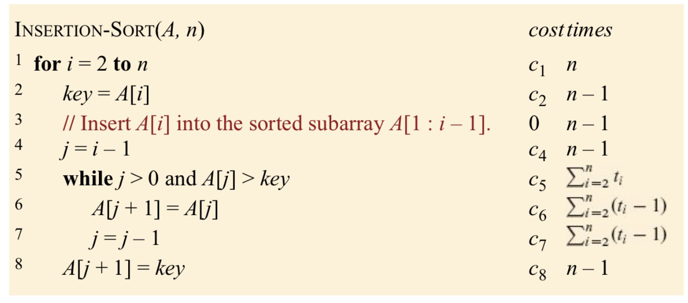

# Introduction to Algorithms

## 2 Getting Started

### 2.1 Insertion sort

Insertion sort is efficient for sorting a small number of elements. It takes two parameters: an array A containing the vale to be sorted and the number $n$ of values of sort.

```pseudocode
Instertion sort(A,n)
	for i = 2 to n
		key = A[i]
		j = i - 1
		while j > 0 and A[j] > key
			A[j+1] = A[j]
			j = j-1
		A[j+1] = key

```

This pseudocode includes two loops. The first for loop is just the simple traverse of A. Since we need to check **A[i]** and **A[i-1]**, it must start with $i= 2$. Then, we call the current element that is ready to sort as **key**. The second while loop is to sort the current element using **j**. The loop will iterate all the elements before index **i**. It will stop if all the elements are checked or the current element is large than **key**. In each while loop, **A[i+1]** will equal to **A[i],** or we can say the elements will shift one index to the right. Finally, we find the correct position and set the **A[j]** as key.

Here is the example of Insertion sort.


```c++
vector<int> InsertionSort(vector<int> & a){
    for(int i = 1; i < a.size(); i++){
        int current = a[i];
        int j = i - 1;
        while (j >= 0 && a[j] > current) {
            a[j+1] = a[j];
            j--;
        }
        a[j+1] = current;
    }
    return a;
}
```


#### Loop Invariants

It can help us to understand why an algorithm is correct. It can be divided into three parts:

**Initialization:**	It is true prior to the first iteration of the loop

**Maintenance:**	If it is true before an iteration of the loop, it remains true before the next iteration.

**Termination:** 	The loop terminates, and when it terminates, the invariant–usually along with the reason that the loop terminated–gives us a useful property that helps show that the algorithm is correct. 

### 2.2 Analyzing algorithms

#### Random-access Machine

RAM is a model of the technology that it runs on, including the resources of that technology and a way to express their costs. In and RAM model, instructions execute one after another, with no concurrent operations. It assumes that each instruction takes the same amount of time as any other instruction and that each data access takes the same amount of time as any other data access.

#### Analysis of Insertion Sort

The running time of an algorithm on a particular input is the number of instructions and data accesses executed. 



Then, add them together:
$$
T(n) = c_1n+c_2(n-1)+c_4(n-1)+c_5\sum_{i=2}^{n}t_i+c_6\sum_{i=2}^{n}(t_i-1)+c_7\sum_{i=2}^{n}(t_i-1)+c_8(n-1) \\
$$

#### Worst-case and average-case analysis

Worst-case is the upper bound on the rynnung time of any input. The “average case” is often roughly as bad as the worst case. Also, remeber the order of the growth:
$$
O(1) \ll  O(\log n) \ll O(n) \ll O(n\log n) \ll O(n^c)\ll O(c^n)\ll O(n!)
$$

### 2.3 Designing algorithms

#### The divide-and-conquer method

Many useful algorithms are **recursive** in structure. In the divide-and-conquer method, if the problem is samll enough, hitting the **base case**, we can just solve it directly. 

**Divide**	the problem into one or more subproblems that are smaller instances of the same problem.

**Conquer**	the subproblems by. solving them recursively.

**Combine**	the subproblem solutions to form a solution to the orginial problem.

The merge sort algorithm is the example of the divide-and-conquer method. The time cost of merge sort is $O(n \log n)$

## 3 Characterizing Running Times

### 3.1 $O$, $\Omega$, $\Theta$ notation

#### $O$-notation

It is the **upper** bound on the asymptotic behavior of a function. 

#### $\Omega$-notation

It is the **lower** bound on the asymptotic behavior of a function. 

#### $\Theta$-notation

It is the **tight** bound on the asymptotic behavior of a function.  Or, we can say $O \ge\Theta \ge \Omega$ .

### 3.2 Asymptotic notation: formal definition

We use low siginal to represent the bound that is not asymtotically. 

- $O \rarr o$
- $\Omega \rarr \omega$
- $\Theta \rarr \theta$

#### Comparing funtions

For the following, assume that $f(n)$ and $g(n)$ are asymptotically positive.

##### Transitivity

$f(n) = \Theta(g(n))$ And $g(n)= \Theta(h(n))$ Imply $f(n) = \Theta(h(n))$

##### Reflexivity

$f(n) = \Theta(f(n))$, $f(n) = O(f(n))$, $f(n)= \Omega(f(n))$

##### Symmetry

$f(n) = \Omega(g(n))$ if and only if $g(n) = \Theta(f(n))$

##### Transpose symmetry

$f(n) = O(g(n))$ if and only if $g(n) = \Theta(f(n))$

$f(n) = o(g(n))$ if and only if $g(n) = \theta(f(n))$

$f(n)$ is a**symptotically smaller** then $g(n)$ if $f(n) = o(g(n))$

 $f(n)$ is **asymptotically larger** then $g(n)$ if $f(n) = \omega(g(n))$

**Trichotomy**	For ant two real numbers $a$ and $b$, exactly one of the following must hold: $a<b$, $a=b$, $a>b$.